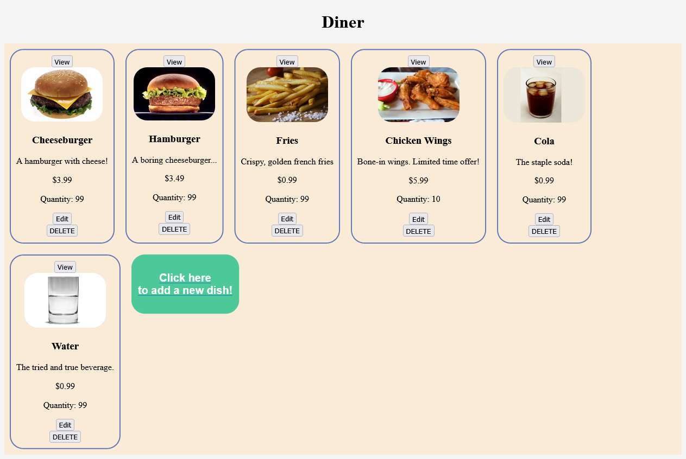
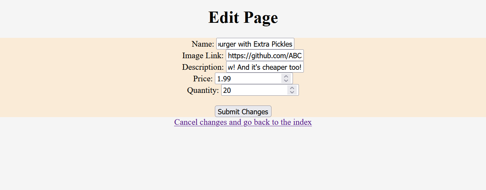
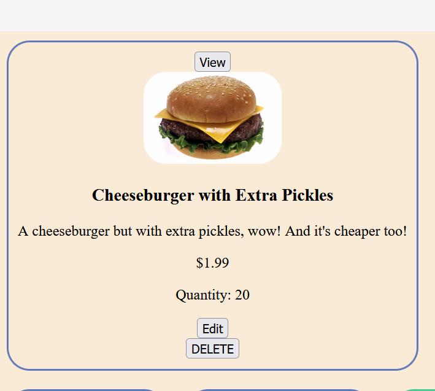
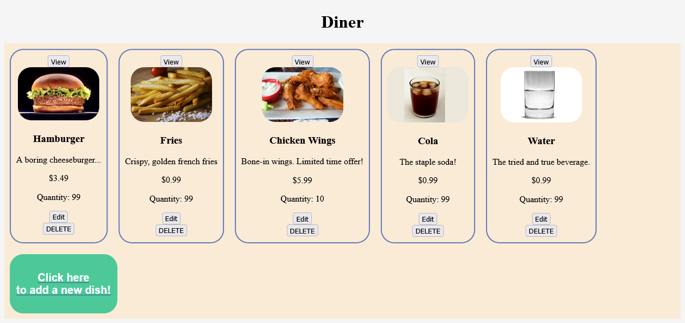
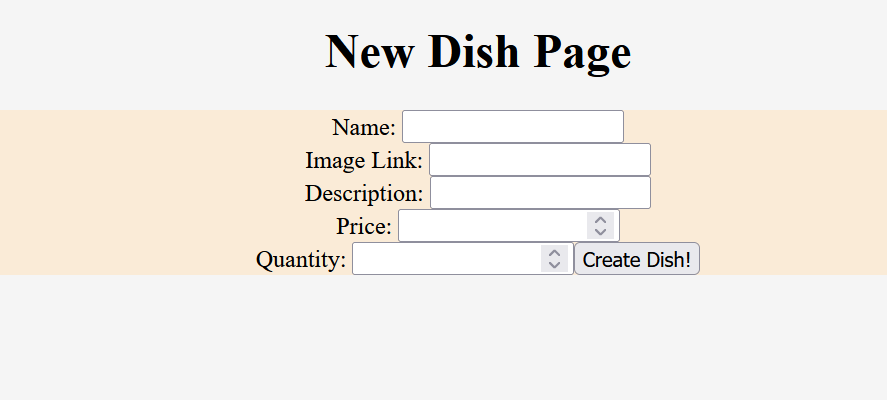
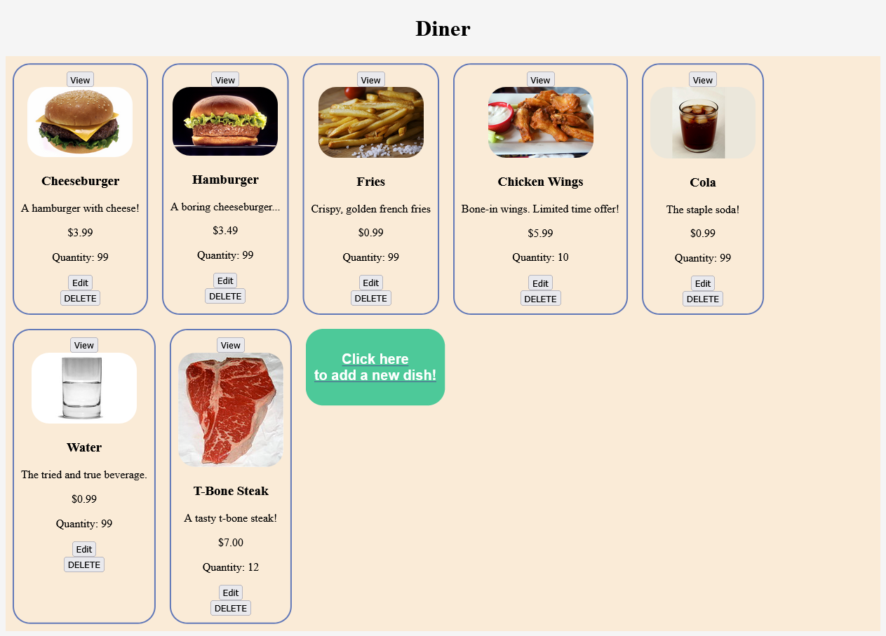
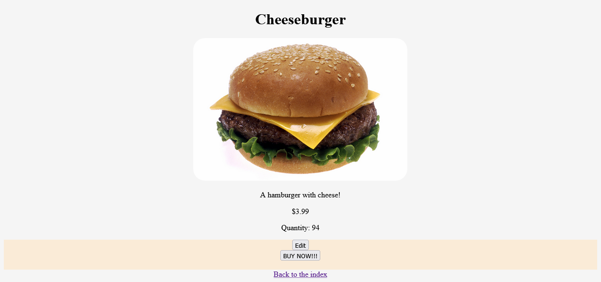
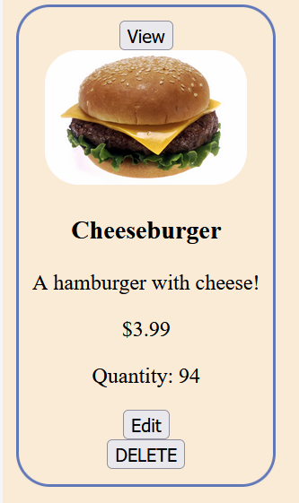

# <a href="https://acardiner.herokuapp.com/products">My Store Project - Diner</a>

### A fullstack application using node.js and mongoDB, deployed via Heroku.

The goal of this application was to create a web app that interacts with a live database, which can be manipulated by the user to create, edit, or delete entries in the database. The application has a diner theme but the user is free to add whatever they wish to it.
 Link to the application on Heroku: <a>https://acardiner.herokuapp.com/products</a>

### A video demonstration of the application at work.

<iframe width="560" height="315" src="https://www.youtube.com/embed/ygmYXh-YyIY" title="YouTube video player" frameborder="0" allow="accelerometer; autoplay; clipboard-write; encrypted-media; gyroscope; picture-in-picture" allowfullscreen></iframe>

### A step by step guide on how to install and use this application locally.

First, download the repository to your PC. You can download it as a ZIP file. 

Now that we've downloaded the repository (don't forget to extract the zip), you'll need the node_modules folder and the .env file that is in the gitignore.  We'll install the node_modules first. Open up the repository in Visual Studio, then open your terminal and run `npm install`. 
Next, you will want to create a .env file to and connect your mongoDB to it, using the connection string provided to you by the site. 
After doing this, you will want to seed the database using my seeds.js file. You can do this with the command `node seeds.js`. 
After installing these, use the command `nodemon`. You should be able to navigate to http://localhost:3000/products after this.

### Some examples of what the application looks like when installed.

##### The /products Index page.

##### A preview of the Edit view, accessed from the Edit button on an item.

##### A demonstration of how the index updates to reflect a new edit.

##### A display of the Delete button at work.

##### A display of the page you're taken to when you click on the green "create" button.

##### Showing what happens after you create an entry.

##### A display of the Show view, accessed from clicking the View button.

##### A display of the buy button's function, decreasing the quantity of the item.

##### Demonstration of how this change to quantity is preserved in the index view.

